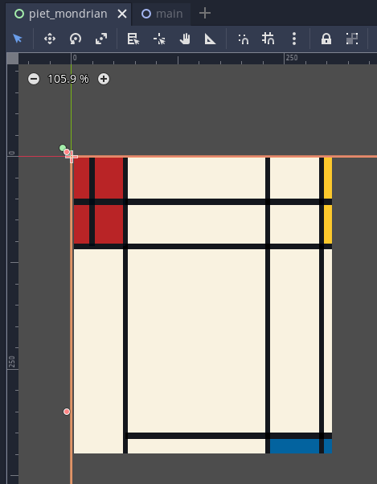

# shaders
A repository to study [The book of shaders](https://thebookofshaders.com) using Godot Engine.

##Challenges
## Piet Mondrian shader challenge
The challenge consists of create a shader that resembles a [Piet Mondrian](https://en.wikipedia.org/wiki/Piet_Mondrian) painting.

Here is the result of the shader:

